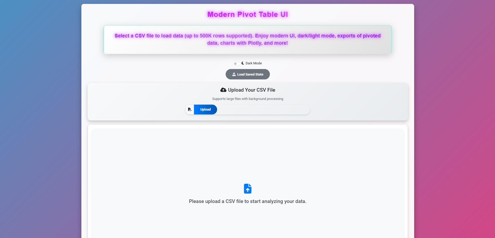
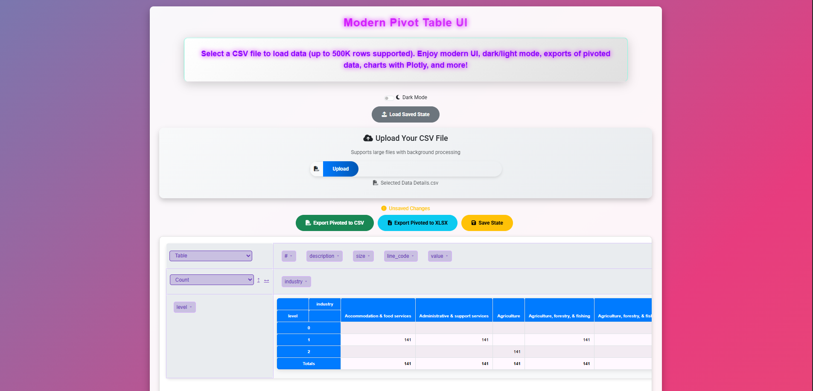
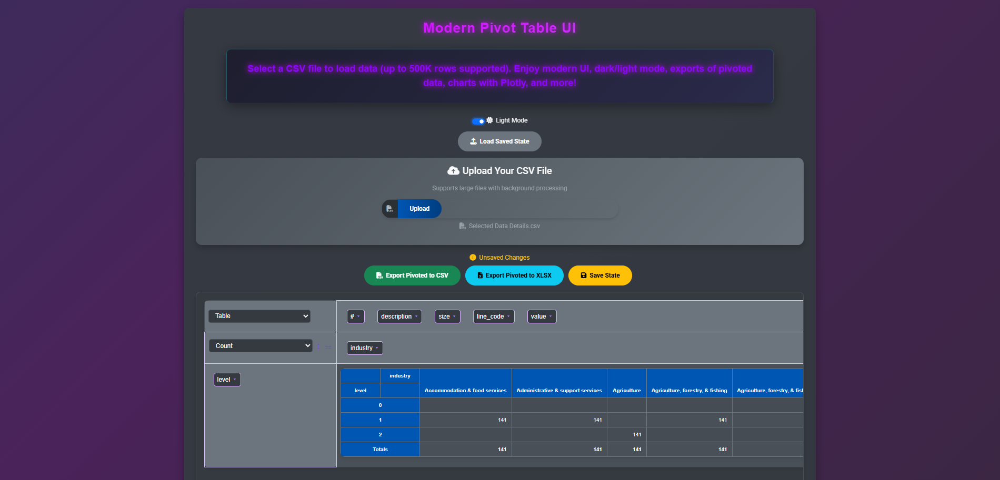

# ⚡ Modern Pivot Table UI
**A next-generation, offline CSV analytics experience — fast, elegant, and powerful.**



> **No backend • 500K+ rows • Plotly Visuals • Dark/Light • Drill-down • State Save/Load**

[](LICENSE)
[](#)
[](#)
[](#)

---

## ✨ Features

- Ultra-fast pivot engine with **virtual scroll** (500K+ rows)
- Beautiful, interactive **Plotly.js** charts (Bar, Line, Heatmap, Treemap, 3D…)
- Smooth **Dark / Light** theme switching
- Save & restore pivot states instantly
- Export results to **CSV** or **Excel (XLSX)**
- Double-click cells → **Immediate drill-down**
- Full detail page with **DataTables** (search, sort, export)
- Pure client-side — **zero server required**
- Clean UI, fully responsive & mobile-friendly

---

## 📸 Screenshots

| Light Mode | Dark Mode |
|-----------|-----------|
|  |  |

| Pivot + Chart | Cell Action Modal |
|---------------|------------------|
|  |  |

| Detail – Light | Detail – Dark |
|----------------|----------------|
|  |  |

---

## 🚀 Quick Start

1. Open **`index.html`**
2. Upload your CSV file  
3. Drag & drop fields → Rows / Columns / Values  
4. Pick a chart renderer (Plotly recommended)  
5. Double-click any cell to **view details** or **export Excel**  

---

## 📂 Project Structure

```text
├── index.html          → Main pivot interface
├── detail.html         → Raw data drill-down view
├── css/                → Bootstrap + custom neon styles
├── js/                 → Pivot.js, Plotly, DataTables, XLSX, helpers
└── screenshots/        → UI & dashboard preview images
```

---

## 👤 Author

Ashkan Norouzi • © 2025
⭐ If this helped you, consider giving it a star!
